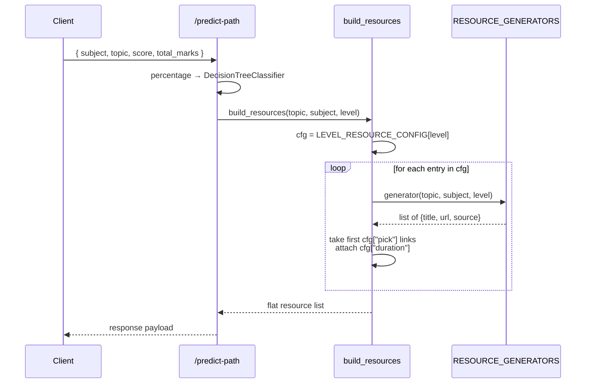
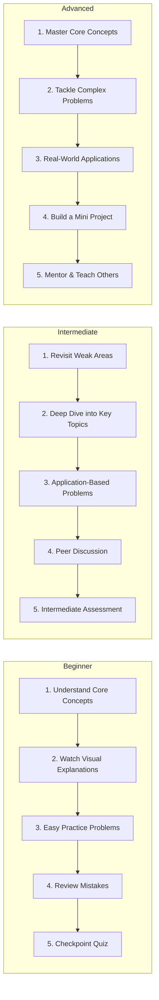

# Machine Learning Pipeline: Personalized Learning Paths

This document describes the ML service that turns a student's quiz score into a personalized study plan: a difficulty tier, a curated resource bundle, a step-by-step roadmap, and a coaching tip. It is the source of truth for [`ml_service/main.py`](ml_service/main.py) and [`ml_service/train_model.py`](ml_service/train_model.py).

---

## Table of Contents

1. [Overview](#1-overview)
2. [Tech Stack](#2-tech-stack)
3. [High-Level Architecture](#3-high-level-architecture)
4. [The Predictive Model](#4-the-predictive-model)
   - [4.1 Algorithm and training data](#41-algorithm-and-training-data)
   - [4.2 Inference path](#42-inference-path)
5. [Resource Orchestration](#5-resource-orchestration)
   - [5.1 Resource generators](#51-resource-generators)
   - [5.2 Per-level composition](#52-per-level-composition)
6. [Roadmap & Tips](#6-roadmap--tips)
7. [API Reference](#7-api-reference)
8. [Edge Cases & Failure Modes](#8-edge-cases--failure-modes)
9. [Glossary](#9-glossary)

---

## 1. Overview

The pipeline takes one quantitative input — `score / total_marks` — and emits a fully composed learning plan:

1. A **difficulty tier** (`beginner`, `intermediate`, `advanced`) predicted by a small scikit-learn model.
2. A **resource bundle** generated from search-URL templates so links never 404.
3. A **roadmap** of 5 ordered steps, each starting in `"upcoming"` status for the client to tick off.
4. A short **tip** appropriate to the predicted level.

The service is intentionally simple: the ML stage is a single-feature classifier, and the bulk of the value is in the deterministic post-processing that turns one tier label into a structured plan.

---

## 2. Tech Stack

| Layer            | Choice                          | Purpose                                                       |
|------------------|---------------------------------|---------------------------------------------------------------|
| Web framework    | FastAPI + Pydantic              | Typed request/response on `/predict-path`                     |
| Model            | `sklearn.tree.DecisionTreeClassifier` | 1-feature percentage → tier classifier                  |
| Persistence      | `joblib`                        | Loads `learning_path_model.pkl` at startup                    |
| URL generation   | `urllib.parse.quote_plus`       | Encodes topic/subject into platform search URLs               |
| Numeric          | `numpy`                         | Inference input shaping (`[[percentage]]`)                    |

The model is loaded once on import; failures during load are caught and printed but do **not** abort startup, so a missing `.pkl` will surface only when `/predict-path` is hit.

---

## 3. High-Level Architecture

```mermaid
flowchart LR
    A([Client POST /predict-path<br/>subject, topic, score, total_marks]) --> P[Compute percentage<br/>guard against total_marks=0]
    P --> M[DecisionTreeClassifier<br/>predict on `[[percentage]]`]
    M --> L{difficulty_level}
    L --> R[build_resources<br/>topic, subject, level]
    L --> RM[ROADMAP_TEMPLATES<br/>level → 5 steps]
    L --> T[TIPS_MAP<br/>level → coaching tip]
    R --> OUT([JSON response:<br/>tier + resources + roadmap + tip + ai_message])
    RM --> OUT
    T --> OUT
```

There is no per-request state and no database; the service is fully stateless aside from the in-memory model object.

---

## 4. The Predictive Model

### 4.1 Algorithm and training data

The model in [`ml_service/train_model.py`](ml_service/train_model.py) is a `DecisionTreeClassifier` fit on 12 synthetic samples mapping percentage to tier:

| Percentage range | Label          | Training samples                  |
|------------------|----------------|-----------------------------------|
| `< 40%`          | `beginner`     | `10, 25, 35, 15`                  |
| `40% – 75%`      | `intermediate` | `45, 55, 65, 60`                  |
| `> 75%`          | `advanced`     | `80, 90, 98, 85`                  |

Because the tree has only one feature and the labels are linearly ordered, the learned decision boundaries are effectively the thresholds above. A plain `if/elif` would behave equivalently; the model is kept so the thresholds can be retrained on real student data later without changing call sites.

### 4.2 Inference path

```python
percentage = 0 if total_marks == 0 else (score / total_marks) * 100
prediction = model.predict([[percentage]])      # shape (1, 1)
difficulty_level = prediction[0]                # 'beginner' | 'intermediate' | 'advanced'
```

The wrapping `[[ ]]` is required: scikit-learn expects a 2-D array `(n_samples, n_features)`. `total_marks == 0` is handled explicitly to avoid `ZeroDivisionError`.

---

## 5. Resource Orchestration

The orchestration layer never stores hardcoded article URLs. Instead it builds **search-page URLs** on each platform with `quote_plus(topic + subject)` so the user lands on a results page that always exists for any topic.



### 5.1 Resource generators

Five generator functions, registered in `RESOURCE_GENERATORS`:

| Type       | Function          | Sources (in order; `pick` takes from the top)                                  |
|------------|-------------------|--------------------------------------------------------------------------------|
| `video`    | `_video_links`    | YouTube, Khan Academy, Coursera, MIT OpenCourseWare                            |
| `article`  | `_article_links`  | Wikipedia, GeeksForGeeks, Khan Academy, Medium, Tutorialspoint                 |
| `quiz`     | `_quiz_links`     | Quizlet, Khan Academy, Brainscape                                              |
| `practice` | `_practice_links` | GeeksForGeeks, HackerRank, LeetCode                                            |
| `project`  | `_project_links`  | GitHub, freeCodeCamp, Dev.to                                                   |

Order matters: `build_resources` slices `links[:cfg["pick"]]`, so reordering a generator's list changes which sources a tier sees. Each link is shaped as `{"title", "url", "source"}` and gets a `"type"` and `"duration"` attached during composition.

### 5.2 Per-level composition

`LEVEL_RESOURCE_CONFIG` defines the exact mix returned for each tier. Values are taken verbatim from [`ml_service/main.py`](ml_service/main.py):

| Level         | Resource type | Pick | Duration |
|---------------|---------------|------|----------|
| **beginner**  | article       | 2    | 15 min   |
|               | video         | 2    | 20 min   |
|               | quiz          | 1    | 10 min   |
|               | practice      | 1    | 20 min   |
| **intermediate** | article    | 2    | 25 min   |
|               | video         | 1    | 25 min   |
|               | practice      | 2    | 30 min   |
|               | quiz          | 1    | 15 min   |
| **advanced**  | article       | 1    | 30 min   |
|               | video         | 1    | 30 min   |
|               | project       | 2    | 60 min   |
|               | practice      | 2    | 40 min   |

The progression encodes the pedagogical intent: beginners get more passive exposure (videos/articles) and a low-stakes quiz; advanced learners trade videos for **projects**, which only appear at this tier.

If `LEVEL_RESOURCE_CONFIG` is queried with an unknown key (e.g., the model returns a label not in the map), the function falls back to the `beginner` config — a deliberately safe default.

---

## 6. Roadmap & Tips

Alongside resources, each tier gets a 5-step roadmap from `ROADMAP_TEMPLATES`. Every step is returned with `status: "upcoming"`; the client mutates this as the student progresses.



`TIPS_MAP` adds a one-liner per tier:

| Level         | Tip                                                                                              |
|---------------|--------------------------------------------------------------------------------------------------|
| beginner      | Don't rush! Focus on understanding the 'why' behind each concept before moving on.               |
| intermediate  | You're making great progress! Try explaining concepts to a friend to deepen your understanding.  |
| advanced      | Excellent work! Consider exploring competitive/research-level problems to push your boundaries.  |

---

## 7. API Reference

### `POST /predict-path`

Pydantic-validated JSON body (`StudentPerformance`).

| Field         | Type   | Required | Notes                                  |
|---------------|--------|----------|----------------------------------------|
| `subject`     | string | yes      | Free-form; embedded in search queries  |
| `topic`       | string | yes      | Free-form; primary search keyword      |
| `score`       | float  | yes      | Marks the student earned               |
| `total_marks` | float  | yes      | `0` is allowed and forces percentage=0 |

**Response 200**
```json
{
  "subject": "Biology",
  "topic": "Photosynthesis",
  "score_percentage": 62.5,
  "predicted_difficulty": "intermediate",
  "resources": [
    {
      "title": "Photosynthesis - Wikipedia",
      "type": "article",
      "url": "https://en.wikipedia.org/w/index.php?search=Photosynthesis+Biology&title=Special%3ASearch",
      "source": "Wikipedia",
      "duration": "25 min"
    }
  ],
  "roadmap": [
    { "step": 1, "title": "Revisit Weak Areas", "description": "...", "status": "upcoming" }
  ],
  "tip": "You're making great progress! ...",
  "ai_message": "Based on your score of 62.5% in Photosynthesis, you're at the intermediate level."
}
```

The `resources` array is flat (not grouped by type); each item carries its own `type` field for client-side grouping.

### `GET /health`

Returns `{ "status": "ok", "model": "learning_path_model.pkl" }`. Note: this only confirms the service is up — it does not re-check whether the model loaded successfully.

---

## 8. Edge Cases & Failure Modes

- **`total_marks == 0`** — handled explicitly; percentage becomes `0` and the predicted tier is `beginner`. No 500.
- **Model file missing or corrupt** — `joblib.load` raises and is caught at import time, but `model` is then undefined. Subsequent `/predict-path` calls will raise `NameError`. The `/health` endpoint will still return `ok`, which is misleading.
- **Unknown tier label from the model** — both `LEVEL_RESOURCE_CONFIG.get(...)` and `ROADMAP_TEMPLATES.get(...)` fall back to the `beginner` configuration. `TIPS_MAP.get(...)` falls back to an empty string.
- **Generator returns fewer items than `pick`** — `links[:cfg["pick"]]` simply yields what is available; the response is shorter rather than erroring.
- **Search URL behaviour off-platform** — every URL is a search page, not a deep link. If a platform changes its search URL format, links still resolve to the platform's homepage in most cases, but the search-prefilling will silently break. There is no automated check for this.
- **Stateless service** — no caching of past requests. Identical inputs produce identical outputs (the classifier is deterministic and `quote_plus` is pure), which is fine for the current scale but means there is no memoization if the same student submits the same quiz twice.

---

## 9. Glossary

- **Difficulty tier** — one of `beginner`, `intermediate`, `advanced`; the only ML output the rest of the pipeline branches on.
- **Search URL** — a platform's results page parameterized with the topic, e.g. `youtube.com/results?search_query=...`. Always 200, even for nonsense queries.
- **`pick`** — the number of links taken from a generator's list for a given tier; defined in `LEVEL_RESOURCE_CONFIG`.
- **Roadmap step status** — string field (`"upcoming"`, `"in-progress"`, `"completed"`) the client mutates; the server only ever sets it to `"upcoming"`.
- **DecisionTreeClassifier** — scikit-learn's CART implementation; here used as a 1-feature classifier whose splits encode percentage thresholds.
