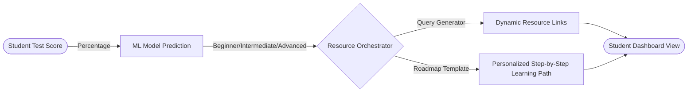
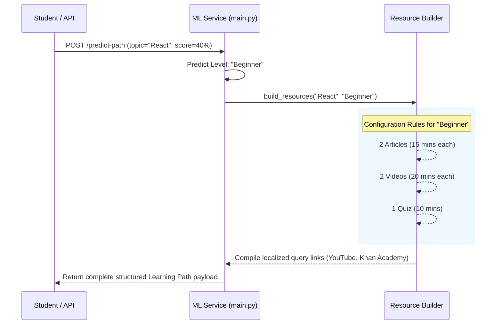
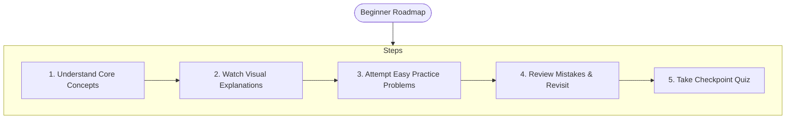

# Machine Learning Pipeline: Personalized Learning Paths

This document details the Machine Learning pipeline responsible for dynamically analyzing student performance and automatically generating personalized study roadmaps.

## 1. Overview of the Learning Path Generation

The pipeline translates a student's quantitative performance (their quiz or test score) into a qualitative understanding metric using a pre-trained scikit-learn Machine Learning model. Based on the predicted skill tier, the system dynamically curates a list of optimal learning resources and a structured study roadmap tailored exactly to their level of mastery.

## 2. The Predictive ML Model

The core of the system uses a serialized Machine Learning model (`learning_path_model.pkl`).

1. **Input Transformation**: Upon a test submission, the system evaluates the student's `score` against the `total_marks` achievable to compute a raw percentage.
2. **Model Inference**: The percentage array `[[percentage]]` is fed into the loaded joblib model.
3. **Tier Classification**: The model predicts specific difficulty buckets for the student:
   - **Beginner**: Requires foundational reinforcement.
   - **Intermediate**: Needs applied practice and edge-case correction.
   - **Advanced**: Prepared for complex projects, mastery, and mentorship.

## 3. Dynamic Resource Orchestration

When the model defines a student's level, the API calls the `build_resources` engine. It generates resources dynamically using web search queries that are guaranteed to yield results (never encountering 404s), rather than maintaining a fragile, hardcoded list of static URLs.

### URL Generation Matrix (Resource Generators)

The orchestration targets 5 primary modalities, formulating `quote_plus` URLs so the student is immediately redirected to relevant study material:

- **Video (_\_video_links_)**: Generates searches on YouTube, Khan Academy, Coursera, and MIT OCW.
- **Article (_\_article_links_)**: Points to Wikipedia, GeeksForGeeks, and Medium.
- **Quiz (_\_quiz_links_)**: Redirects to Quizlet or Brainscape flashcard sets.
- **Practice (_\_practice_links_)**: Yields HackerRank, LeetCode, and GeeksforGeeks practice problem lists.
- **Project (_\_project_links_)**: Facilitates GitHub repo searches and freeCodeCamp tutorial queries.

### Adaptive Composition (Configuration Layer)

The `LEVEL_RESOURCE_CONFIG` object determines exactly what _type_ of resources to fetch based on the ML model's output:

- **Beginners** are heavily weighted toward Videos and Articles to establish core concepts.
- **Advanced** students are immediately given Project and Practice links in favor of fewer videos, emphasizing hands-on application over passive learning.

## 4. Personalized Checkpoint Roadmaps

Alongside dynamic links, the pipeline delivers a progressive `ROADMAP_TEMPLATES` object containing logical next steps.

Each step initializes in an `"upcoming"` status. On the client side, students interact with these steps, marking them off as they progress. This transforms the arbitrary test scores into a concrete, actionable journey toward subject mastery.
