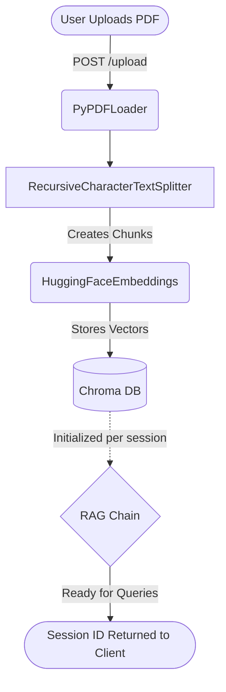
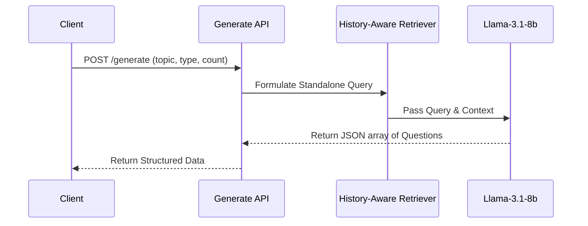

# Automated Essay Grading and RAG Architecture

This document details the workings of the Retrieval-Augmented Generation (RAG) system handling PDF document ingestion, automated question generation, and rigorous essay evaluation.

## 1. High-Level Architecture Flow



## 2. In-Depth Component Breakdown

### A. PDF Ingestion and Vector Store Initialization (`/upload`)

When a teacher or student uploads a PDF, the application instantiates a specialized RAG pipeline just for that document:

1. **Extraction**: `PyPDFLoader` extracts text and retains source metadata.
2. **Chunking**: `RecursiveCharacterTextSplitter` breaks the text into chunks of 1000 characters with a 100-character overlap. This overlap ensures contextual continuity between consecutive chunks.
3. **Embedding**: The text chunks are passed through the `sentence-transformers/all-MiniLM-L6-v2` embedding model to generate dense semantic vectors.
4. **Vector Store**: The vectors are persisted in a Chroma DB collection unique to the `session_id`. Keeping vectors isolated per session prevents cross-contamination of knowledge between different uploaded documents.

### B. Automated Question Generation (`/generate`)



When generating questions organically from the text:

- The API uses a **History-Aware Retriever**. It takes the chat history and the user's request, reformulating it into a standalone search query.
- The **Chroma Retriever** fetches the top 10 most semantically relevant chunks.
- A **Generate Prompt** explicitly instructs the LLM (Llama 3) to act as an expert educator, producing a specific number of questions in various formats (MCQ, Short Answer, True/False, Fill in the Blanks, Essay).
- The LLM ensures the response strictly matches a JSON schema, making downstream parsing reliable.

### C. Automated Essay Evaluation Pipeline (`/evaluate-essay`)

The essay evaluation is the most critical and complex part of the architecture, relying on a synergistic combination of heuristic analysis and semantic LLM constraints.

```mermaid
flowchart TD
    QA([Student Answer Submitted]) --> B[Extract Word Count & Expected Length]
    B --> C{Session Vector Store Exists?}
    C -- Yes --> D[Retrieve Context for Question]
    C -- No --> E[Evaluate purely on subjective knowledge]

    D --> F[Compute Cosine Similarity between Answer & Context]
    F --> G[Construct Strict Prompt for LLM]
    E --> G

    G -->|Prompt + Context + STRICT RULES| H(Llama-3.1-8b)
    H -->|Raw Score & Feedback| I{Post-Processing Validations}

    I -- Similarity < 0.4 & Score High --> J[Cap Score heavily (10% max)]
    I -- Similarity < 0.5 & Score High --> K[Cap Score moderately (40% max)]
    I -- Passes Similarity Check --> L[Keep LLM Score]

    J --> M([Final AI Evaluation])
    K --> M
    L --> M
```

#### Evaluation Rules & Constraints:

1. **Length Analysis**: The system computes expected length based on maximum marks (approx. 20 words per mark). It caps length rewards so excessively long answers don't get unchecked bonuses.
2. **Semantic Similarity Enforcement**:
   - The system retrieves context related to the actual question text using Chroma DB.
   - It then converts both the student's answer and the retrieved reference context into embeddings using `HuggingFaceEmbeddings`.
   - The **Cosine Similarity** between the student's answer and the reference context is calculated.
3. **Rigorous LLM Prompting**:
   - The LLM receives the student's answer along with the correct Reference Context extracted from the PDF.
   - A _Strict Scoring Rubric_ instructs the LLM that an off-topic answer—no matter how beautifully written or lengthy—must receive exactly **0 marks**.
4. **Post-Processing Verification (The Fallback Capping)**:
   - Even if the LLM hallucinated a generous score, the post-processing script independently checks the previously computed cosine similarity.
   - If similarity is extremely low (`< 0.4`), meaning the answer is semantically disjointed from the source text, any high LLM score is forcefully overridden and capped at just 10% of maximum marks.
   - This prevents students from successfully exploiting the AI grader with persuasive, yet structurally irrelevant text.
