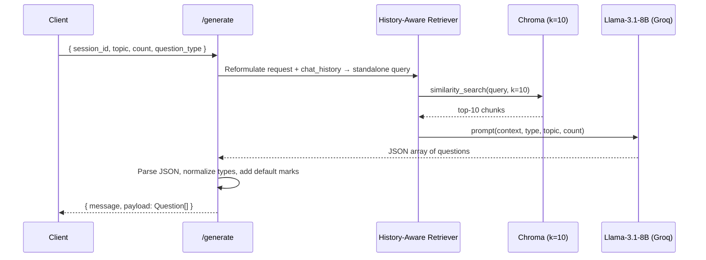
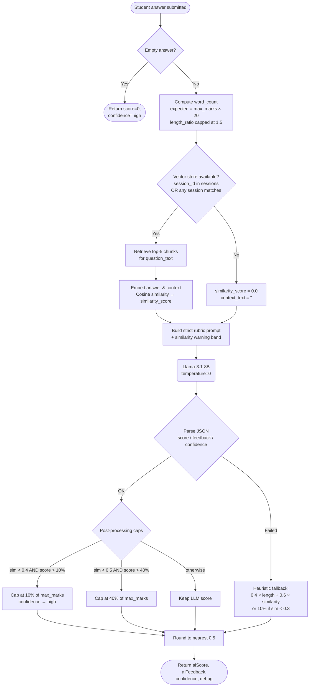

# Automated Essay Grading and RAG Architecture

This document describes the Retrieval-Augmented Generation (RAG) service that powers PDF ingestion, automated question generation, and rigorous essay evaluation. It is the source of truth for how the service in [`rag_service/app.py`](rag_service/app.py) is structured and why.

---

## Table of Contents

1. [Overview](#1-overview)
2. [Tech Stack](#2-tech-stack)
3. [High-Level Architecture](#3-high-level-architecture)
4. [Component Breakdown](#4-component-breakdown)
   - [4.1 PDF Ingestion (`/upload`)](#41-pdf-ingestion-upload)
   - [4.2 Question Generation (`/generate`)](#42-question-generation-generate)
   - [4.3 Essay Evaluation (`/evaluate-essay`)](#43-essay-evaluation-evaluate-essay)
5. [Evaluation Rules & Thresholds](#5-evaluation-rules--thresholds)
6. [API Reference](#6-api-reference)
7. [Configuration](#7-configuration)
8. [Edge Cases & Failure Modes](#8-edge-cases--failure-modes)
9. [Glossary](#9-glossary)

---

## 1. Overview

The service exposes three responsibilities behind a Flask API:

- **Ingest** a PDF into a per-session vector store so its content becomes searchable.
- **Generate** structured questions (MCQ, True/False, Short Answer, Essay, Fill-in-the-Blanks) grounded in the uploaded document.
- **Evaluate** student essay answers using a combination of semantic similarity, a strict LLM rubric, and deterministic post-processing guardrails.

The design goal is **graded reliance on the LLM**: the model handles language understanding, but heuristic and embedding-based checks bound the score so a fluent off-topic answer cannot exploit the grader.

---

## 2. Tech Stack

| Layer            | Choice                                          | Purpose                                                    |
|------------------|-------------------------------------------------|------------------------------------------------------------|
| Web framework    | Flask + Flask-CORS                              | HTTP API surface                                           |
| PDF loader       | `PyPDFLoader` (LangChain Community)             | Page-level text extraction with metadata                   |
| Chunking         | `RecursiveCharacterTextSplitter`                | 1000-char chunks, 100-char overlap                         |
| Embeddings       | `sentence-transformers/all-MiniLM-L6-v2`        | 384-dim dense vectors via HuggingFace                      |
| Vector store     | Chroma (`langchain_chroma`)                     | Persisted on disk, one collection per session              |
| LLM              | Llama 3.1 8B Instant via Groq (`ChatGroq`)      | Question generation + essay scoring (`temperature=0`)      |
| Orchestration    | LangChain history-aware retriever + RAG chain   | Combines retrieval and generation                          |

---

## 3. High-Level Architecture

```mermaid
flowchart TD
    A([Client uploads PDF]) -->|POST /upload| B(PyPDFLoader)
    B --> C[RecursiveCharacterTextSplitter<br/>1000 chars / 100 overlap]
    C --> D(HuggingFaceEmbeddings<br/>all-MiniLM-L6-v2)
    D --> E[(Chroma DB<br/>per-session collection)]
    E --> F{RAG Chain registered<br/>in sessions[session_id]}
    F --> G([session_id returned])

    G -.-> H[POST /generate<br/>questions]
    G -.-> I[POST /evaluate-essay<br/>scoring]
```

State is held in an in-process `sessions` dict keyed by `session_id`; each entry stores the RAG chain, chat history, and original filename. The Chroma collection is persisted under `db/chroma_db/<session_id>/` so it survives across restarts as long as the same `session_id` is used.

---

## 4. Component Breakdown

### 4.1 PDF Ingestion (`/upload`)

When a PDF is uploaded the service builds a fresh RAG pipeline scoped to that file:

1. **Validation** — rejects requests with no file, an empty filename, or a non-`.pdf` extension.
2. **Session ID** — generated as `<sanitized_filename>_<unix_timestamp>` so concurrent uploads of the same document never collide.
3. **Extraction** — `PyPDFLoader` produces one document per page; the source filename is written into each page's `metadata["source"]` for traceability.
4. **Chunking** — `RecursiveCharacterTextSplitter(chunk_size=1000, chunk_overlap=100)` splits the pages. Overlap preserves cross-chunk context (a sentence cut at a chunk boundary still appears whole in the neighbouring chunk).
5. **Embedding & persistence** — chunks are embedded with `all-MiniLM-L6-v2` and written to `db/chroma_db/<session_id>/`. Any pre-existing directory at that path is removed first to avoid mixing prior runs.
6. **Empty-document guard** — if chunking yields zero chunks (scanned/image-only PDFs), the endpoint returns HTTP 400 instead of registering an unusable session.
7. **Chain assembly** — a history-aware retriever is wrapped around a stuff-documents generation chain and stored in `sessions[session_id]`.

### 4.2 Question Generation (`/generate`)



Key behaviours:

- **History-aware retrieval** — the retriever combines the latest user request with prior chat history into a single standalone query before searching, so follow-ups like "now generate harder ones" still resolve to the right document context.
- **Strict JSON contract** — the prompt requires a JSON array; the handler extracts the first `[ ... ]` substring and `json.loads` it. This tolerates leading/trailing prose from the LLM.
- **Type normalization** — the LLM may return labels like `"Multiple Choice"`, `"True/False"`, `"Fill in the Blanks"`. They are mapped to the canonical set `{mcq, truefalse, short, essay, fillblank}` before being returned.
- **Defaults** — missing `marks` defaults to `1`. For `truefalse` questions the handler injects `options: ["True", "False"]`; for non-MCQ types any stray `options` field is removed.
- **Fallback** — if JSON parsing fails the raw LLM string is returned under `payload` with a `(raw)` message, so the client can decide whether to display or retry.

### 4.3 Essay Evaluation (`/evaluate-essay`)

This is the most defensive pipeline in the service. It composes three independent signals — length, semantic similarity, and a strict-rubric LLM judgement — and applies post-hoc capping if those signals disagree.



#### Why three signals instead of just trusting the LLM

| Signal              | What it catches                                                  | What it misses                                  |
|---------------------|------------------------------------------------------------------|-------------------------------------------------|
| Length heuristic    | One-word answers, padding                                        | Wrong content at correct length                 |
| Cosine similarity   | Off-topic answers ("wrote about WWII when asked about photosynthesis") | Plagiarism, factual errors inside the topic |
| LLM rubric          | Conceptual correctness, depth, factual accuracy                  | Confidently wrong scoring on persuasive prose   |

Combining them means a fluent essay on the wrong topic gets capped by similarity even if the LLM was charmed; a brief but accurate answer is not over-penalized for length alone.

#### Session lookup behaviour

The handler accepts an explicit `session_id`. If it is missing or unknown, the code iterates every active session and uses the first one whose Chroma directory exists. This is a pragmatic choice for the current single-tenant deployment — it should be revisited before multi-tenant use, since a student's answer could be scored against another teacher's PDF.

---

## 5. Evaluation Rules & Thresholds

All numeric thresholds below come directly from [`rag_service/app.py`](rag_service/app.py) and are the values the service ships with today.

### 5.1 Length analysis

| Quantity        | Formula                                |
|-----------------|----------------------------------------|
| `expected_words`| `max_marks * 20`                       |
| `length_ratio`  | `min(word_count / expected_words, 1.5)`|

`length_ratio` is consumed by the heuristic fallback only; it is **not** used to inflate the LLM score directly.

### 5.2 Similarity bands embedded in the prompt

| Cosine similarity | Label inserted into prompt                                               |
|-------------------|--------------------------------------------------------------------------|
| `< 0.30`          | `CRITICAL: Semantic similarity is VERY LOW — answer likely off-topic`    |
| `0.30 – 0.49`     | `WARNING: Semantic similarity is LOW — answer may be partially off-topic`|
| `≥ 0.50`          | Plain numeric report                                                     |

These warnings condition the LLM toward stricter scoring before any post-processing runs.

### 5.3 Post-processing caps (independent of LLM output)

| Condition                                                          | Effect                                                                      |
|---------------------------------------------------------------------|-----------------------------------------------------------------------------|
| `similarity < 0.40` **and** LLM score `> 10%` of `max_marks`        | Score capped at `0.10 × max_marks`; confidence forced to `high`             |
| `similarity < 0.50` **and** LLM score `> 40%` of `max_marks`        | Score capped at `0.40 × max_marks`                                          |
| Otherwise                                                          | LLM score kept as-is                                                        |
| Final score                                                        | Rounded to nearest `0.5`, clamped to `[0, max_marks]`                       |

Caps only apply when reference context exists (i.e., a vector store was available). With no context, the LLM is told to evaluate on general subject knowledge and no similarity-based cap is enforced.

### 5.4 Heuristic fallback (LLM unavailable or unparseable)

```
if context_text and similarity_score < 0.30:
    score = max_marks * 0.10
else:
    score = max_marks * min(length_ratio, 1.0) * 0.4
          + max_marks * similarity_score              * 0.6
```

The fallback always returns `confidence: "low"` so the UI can surface that the score needs human review.

---

## 6. API Reference

### `POST /upload`

Multipart form upload.

| Field  | Type | Required | Notes                |
|--------|------|----------|----------------------|
| `file` | file | yes      | Must end with `.pdf` |

**Response 200**
```json
{ "message": "PDF uploaded and processed successfully",
  "session_id": "syllabus.pdf_1714050000",
  "filename": "syllabus.pdf" }
```
**Errors:** 400 (no file / wrong type / unreadable PDF), 500 (unexpected processing error).

### `POST /generate`

JSON body.

| Field           | Type   | Default        |
|-----------------|--------|----------------|
| `session_id`    | string | required       |
| `topic`         | string | `"general"`    |
| `count`         | int    | `5`            |
| `question_type` | string | `"Short Answer"` |

**Response 200** — `payload` is either a normalized question array or, on JSON-parse failure, the raw LLM string with `message: "Questions generated (raw)"`.

### `POST /evaluate-essay`

JSON body.

| Field            | Type   | Default      |
|------------------|--------|--------------|
| `question_text`  | string | `""`         |
| `student_answer` | string | required (empty → score 0) |
| `max_marks`      | number | `10`         |
| `subject`        | string | `"General"`  |
| `topic`          | string | `"General"`  |
| `session_id`     | string | optional     |

**Response 200**
```json
{
  "aiScore": 7.5,
  "aiFeedback": "Covers the main mechanism but omits the role of chlorophyll.",
  "confidence": "medium",
  "debug": {
    "wordCount": 184,
    "expectedWords": 200,
    "lengthRatio": 0.92,
    "similarityScore": 0.612,
    "hasContext": true
  }
}
```
The `debug` block is only present on the LLM path; the heuristic fallback omits it.

### `GET /health`

Returns `{ "status": "ok", "sessions": <count> }`.

---

## 7. Configuration

| Setting              | Where                              | Current value                                  |
|----------------------|------------------------------------|------------------------------------------------|
| Upload directory     | `UPLOAD_DIR`                       | `uploads/`                                     |
| Vector DB root       | `DB_DIR`                           | `db/chroma_db/`                                |
| Chunk size / overlap | `RecursiveCharacterTextSplitter`   | `1000` / `100`                                 |
| Retriever `k`        | Generation                         | `10`                                           |
| Retriever `k`        | Evaluation                         | `5`                                            |
| Embedding model      | `HuggingFaceEmbeddings`            | `sentence-transformers/all-MiniLM-L6-v2`       |
| LLM                  | `ChatGroq`                         | `llama-3.1-8b-instant`, `temperature=0`        |
| Reference truncation | Eval prompt                        | First `3000` characters of retrieved context   |
| Port                 | Flask                              | `5001`                                         |

`GROQ_API_KEY` (read by `langchain_groq` via `dotenv`) is the only required secret.

---

## 8. Edge Cases & Failure Modes

- **Scanned / image-only PDFs** — `PyPDFLoader` returns no text, chunking is empty, `/upload` responds 400. There is no OCR fallback today.
- **Empty student answer** — `/evaluate-essay` short-circuits to score `0`, confidence `high`, before any embedding work.
- **Missing `session_id` on evaluation** — the handler walks active sessions and uses the first with a Chroma directory. Acceptable for single-tenant use; **must not** be used in a multi-tenant context without a stricter lookup.
- **LLM returns malformed JSON** — both `/generate` and `/evaluate-essay` recover: generation returns the raw string, evaluation falls through to the heuristic scorer with `confidence: "low"`.
- **In-memory `sessions` dict** — the dict does not survive a process restart, but Chroma directories on disk do. Re-uploading the same PDF rebuilds the chain; the prior on-disk collection at the matching path is wiped first.
- **Concurrent uploads of the same filename** — distinguished by the timestamp suffix in `session_id`, so collections don't overwrite each other.

---

## 9. Glossary

- **RAG (Retrieval-Augmented Generation)** — pattern where an LLM is grounded in retrieved passages from a vector store rather than relying solely on its parametric knowledge.
- **Chunk** — a span of source text (here ~1000 characters) treated as one retrieval unit.
- **Embedding** — a fixed-length numeric vector representing the meaning of a chunk; semantic similarity becomes vector distance.
- **Cosine similarity** — `(a · b) / (‖a‖ · ‖b‖)`; ranges from `-1` to `1`. Above `~0.5` typically indicates real topical overlap for this embedding model.
- **History-aware retriever** — a retriever that first uses the LLM to rewrite the latest user input plus chat history into a single self-contained query, so retrieval works correctly across multi-turn conversations.
- **Stuff documents chain** — a LangChain pattern that "stuffs" all retrieved chunks into one prompt rather than summarizing them first; appropriate when the total context fits the model window.
